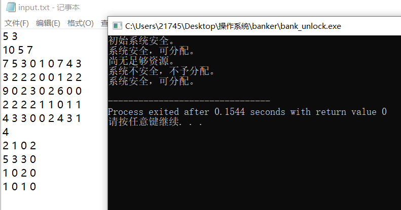
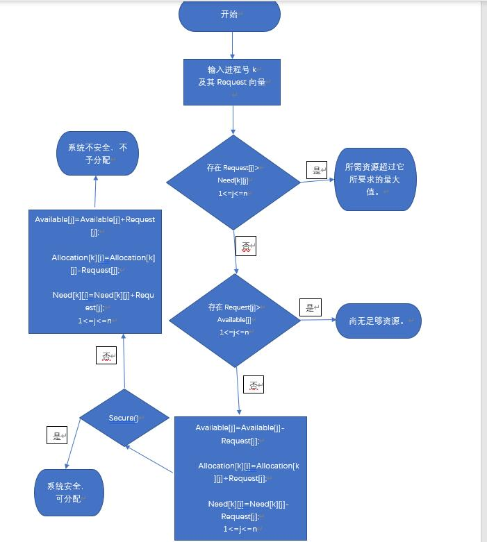
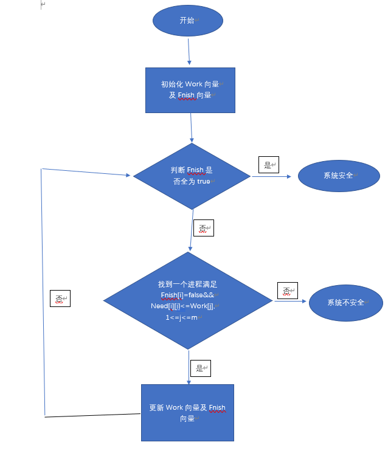

## 操作系统银行家

Dijkstra的银行家算法是最具有代表性的避免死锁算法。

个人觉得银行家算法属于一种贪心，对于系统的当前情况我们需要至少找出一个能完全运行完的进程并且将该进程当前所占用的资源释放出来，这样对于后面的选择会越开越有利，如果没找到，那就表明系统已经发生了死锁。

代码的输入如下，数据来源于课本的例子

>课本指的是西安电子科技大学出版的《计算机操作系统》第四版

```c++
5 3 	//分别表示进程的数量以及资源的种类数				
10 5 7  //表示系统中各种资源的总数
7 5 3 0 1 0 7 4 3//表示系统中各个进程的Max、Allocation、Need向量
3 2 2 2 0 0 1 2 2
9 0 2 3 0 2 6 0 0
2 2 2 2 1 1 0 1 1
4 3 3 0 0 2 4 3 1
4  //表示操作需要执行的次数，操作指的是某个进程对系统提出资源述求
2 1 0 2//表示第2个进程此时需要三种系统资源的数量分别为1、0、2
5 3 3 0
1 0 2 0
1 0 1 0
```

数据的输入设定如此，是因为参照课本写的这个代码

运行结果如下：



流程图我画了两个，一个是banker()函数的，另一个是secure()函数的，其中的secure算法是整个银行家算法的核心。

算法的流程图如下：

banker()



secure()


